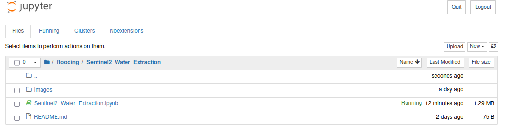

# Sentinel-2 Water Extraction

The sentinel2_water_extraction Jupyter Notebook was developed to extract water
from Sentinel-2 imagery.

Below are the instructions to get the Notebook up and running

## Prerequisites

-  Linux, macOS, or Windows
-  Python

[Tested](.github/workflows/test.yml) with:

-  OS:
   -  Ubuntu 22.04 (Jammy Jellyfish)
   -  macOS 12 (Monterey)
   -  Windows Server 2022
-  Python:
   -  3.8
   -  3.9
   -  3.10

## Get the Jupyter Notebook

Either clone or download the Jupyter Notebook

### Clone the Notebook

Clone this repository to your computer

`git clone git@github.com:linz/emergency-management.git`

### Download the Notebook

Alternatively, for those not familiar with git, download the repository. This
can be downloaded via the code menu in the root of this repository (see below)


## Install Python dependencies

The following commands will install the dependencies for just this project:

```shell
pip install --upgrade pip
pip install --upgrade poetry
poetry install --only=main --no-root
```

## Start the Jupyter Notebook

Once you have the code locally, it can be executed to extract water

Open the terminal and navigate to the notebook directory

`cd <path where downloaded to>/emergency-management/flooding/sentinel2_water_extraction`

Start the notebook

`$ poetry run jupyter notebook sentinel2_water_extraction.ipynb`

Open the Jupyter Notebook by clicking on sentinel2_water_extraction.ipynb (see
image below) 

## Extract Water From Sentinel-2 imagery

Follow the steps in the Notebook to extract water polygons.

## Troubleshooting

### SSL cert errors

If encountering an SSL cert error, try exporting a reference to
`ca-certificates.crt`

e.g `export CURL_CA_BUNDLE=/etc/ssl/certs/ca-certificates.crt`
